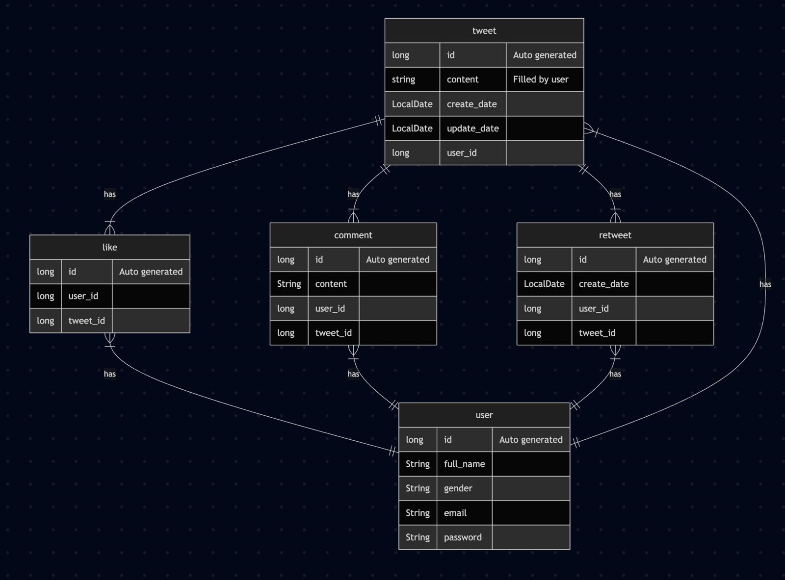

# Twitter API

A REST API for a Twitter-like social platform, built with Java and Spring Boot. The application supports user authentication, tweets, comments, likes, and retweets with ownership-based authorization rules.

## Features

- User registration and login
- Session-based authentication with Spring Security
- BCrypt password hashing
- Create, read, update, and delete tweets
- Tweet ownership checks for update and delete operations
- Create, update, and delete comments
- Comment ownership and tweet ownership authorization
- Like and unlike tweets
- Duplicate-like prevention
- Retweet and undo-retweet operations
- Duplicate-retweet prevention
- Centralized exception handling
- Service and repository tests

## Tech Stack

| Area | Technologies |
| --- | --- |
| Language | Java 17 |
| Framework | Spring Boot 3.2.1, Spring Web |
| Security | Spring Security, BCrypt, HTTP sessions |
| Database | PostgreSQL |
| Persistence | Spring Data JPA, Hibernate |
| Testing | JUnit 5, Mockito, H2 |
| Build Tool | Maven |

## Architecture

The project follows a layered architecture:

- **Controller:** Handles HTTP requests and responses
- **Service:** Contains business logic and authorization rules
- **Repository:** Manages database operations with Spring Data JPA
- **Entity:** Defines the database model and relationships
- **DTO:** Transfers request data between the API and service layers
- **Security:** Configures authentication and protected endpoints
- **Exception:** Provides centralized API error handling

## Data Model

The main entities are `User`, `Tweet`, `Comment`, `Like`, and `Retweet`.



## API Endpoints

All endpoints except registration and login require an authenticated session.

### Authentication

| Method | Endpoint | Description |
| --- | --- | --- |
| POST | `/auth/register` | Register a new user |
| POST | `/auth/login` | Log in and create a session |

### Tweets

| Method | Endpoint | Description |
| --- | --- | --- |
| POST | `/tweet` | Create a tweet |
| GET | `/tweet/findById/{id}` | Get a tweet by ID |
| GET | `/tweet/findByUserId/{userId}` | Get the authenticated user's tweets |
| PUT | `/tweet/{id}` | Update a tweet owned by the authenticated user |
| DELETE | `/tweet/{id}` | Delete a tweet owned by the authenticated user |

### Comments

| Method | Endpoint | Description |
| --- | --- | --- |
| POST | `/comment` | Add a comment to a tweet |
| PUT | `/comment/{id}` | Update a comment owned by the authenticated user |
| DELETE | `/comment/{id}` | Delete a comment as its owner or the tweet owner |

### Likes

| Method | Endpoint | Description |
| --- | --- | --- |
| POST | `/like` | Like a tweet |
| POST | `/dislike` | Remove the authenticated user's like |

### Retweets

| Method | Endpoint | Description |
| --- | --- | --- |
| POST | `/retweet` | Retweet a tweet |
| DELETE | `/retweet/{tweetId}` | Undo the authenticated user's retweet |

## Getting Started

### Prerequisites

- Java 17
- PostgreSQL
- Git

### 1. Clone the repository

```bash
git clone https://github.com/sirmaatak/twitter-api-spring-boot.git
cd twitter-api-spring-boot
```

### 2. Create the database schema

Run the following command in PostgreSQL:

```sql
CREATE SCHEMA IF NOT EXISTS tweet;
```

### 3. Configure the database

Update `src/main/resources/application.properties` with your local PostgreSQL credentials:

```properties
spring.datasource.url=jdbc:postgresql://localhost:5432/postgres
spring.datasource.username=your_username
spring.datasource.password=your_password
spring.jpa.hibernate.ddl-auto=update
```

### 4. Start the application

macOS or Linux:

```bash
sh mvnw spring-boot:run
```

Windows:

```powershell
mvnw.cmd spring-boot:run
```

The API will be available at:

```text
http://localhost:8080
```

## Authentication Example

Register a user:

```bash
curl -X POST http://localhost:8080/auth/register \
  -H "Content-Type: application/json" \
  -d '{"fullName":"Jane Doe","email":"jane@example.com","password":"strong-password"}'
```

Log in and save the session cookie:

```bash
curl -c cookies.txt -X POST http://localhost:8080/auth/login \
  -H "Content-Type: application/json" \
  -d '{"email":"jane@example.com","password":"strong-password"}'
```

Create an authenticated tweet:

```bash
curl -b cookies.txt -X POST http://localhost:8080/tweet \
  -H "Content-Type: application/json" \
  -d '{"content":"My first tweet"}'
```

## Running Tests

macOS or Linux:

```bash
sh mvnw test
```

Windows:

```powershell
mvnw.cmd test
```

The test suite includes service-layer unit tests and repository tests using Mockito and H2.

## Project Structure

```text
src
├── main
│   ├── java
│   │   └── controller
│   │   └── dto
│   │   └── entity
│   │   └── exception
│   │   └── repository
│   │   └── security
│   │   └── service
│   └── resources
└── test
    ├── java
    └── resources
```

## Future Improvements

- Add request validation rules
- Use response DTOs instead of returning entities directly
- Move database credentials to environment variables
- Add OpenAPI/Swagger documentation
- Add broader integration test coverage
- Provide a Docker-based development environment

## Training

Developed as part of the [Workintech Full Stack Web Developer Program](https://www.workintech.com.tr/fullstack-web-yazilimci-parttime).
